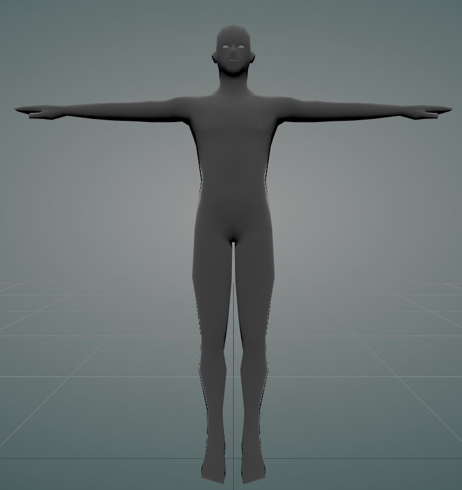

# Human Male
This sample is intended to be the most bare-bones possible. The model only uses the `VRMC_vrm extension` and while fully rigged, only contains the mandatory bones and has no expressions. The `VRMC_vrm` meta information is also kept to a minimum, with only the `meta` and `humanoid` properties present.

## Source files
To base model is made by `VideroBoy` and released under CC0.  
Source: https://opengameart.org/content/low-poly-human-male
